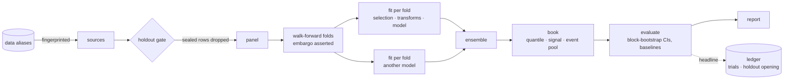
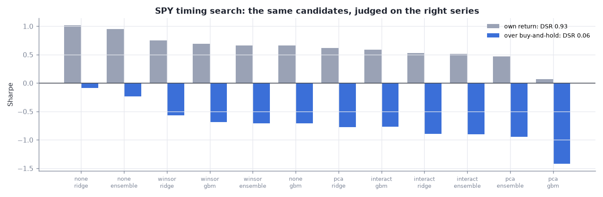

# chairlift

> [!NOTE]
> **This is the public copy of chairlift's development history.** Development continues in a private repository;
> machine-specific paths and internal links in `plans/` and `docs/` were generalized for this copy. To request access
> to the private repository, please email laurent.lanteigne@gmail.com.

**A machine-learning research pipeline that makes a backtest hard to fool yourself with.**

Most backtests do not fail on the model. They fail on the process around it:
- a scaler or feature selection fitted on rows the test year can see
- a holdout looked at "just once" a few times
- forty experiments run, and the best one reported
- a number nobody can rebuild a month later

chairlift turns the research protocol into code, so each of these is impossible or on the record. You declare the
study and chairlift takes it up the hill. The descent is yours, and every run of it is counted.

| what goes wrong in research | what chairlift does about it |
|---|---|
| leakage through preprocessing | selection, transforms (winsorize, interactions, PCA), ensembling and search are fitted **inside each fold, on training rows only**; every fold re-checks its own embargo before it fits |
| peeking at the holdout | sealed rows **do not exist** for the study: the loader drops them. Opening takes a written reason, happens **once**, is logged, and re-keys everything downstream |
| reporting the best of many tries | every distinct experiment is a **trial in a ledger**. The best is judged by its **deflated Sharpe**; a search is judged by **walk-forward selection** (what it would have picked at the time) and **PBO** |
| results you cannot rebuild | stages are keyed by spec, captured values, the source of all the code they reach, the module constants that code reads, and the content of their data. `chairlift rerun` rebuilds a run from its record and says **which stage differs, and why** |
| long jobs that die silently | an event stream, a live view, HTML run reports, systemd submission with a progress-tied watchdog, alerts |

## One pipeline, five very different studies

The test of a research framework is whether real studies of different shapes fit it without forking it. chairlift is
developed against five, and the protocol is the same in each: declare, run in-fold, judge, keep score.

| study | shape | what it stressed | verdict |
|---|---|---|---|
| **slalom** | ~800 single-name option straddles a day; ML ranking of hedged P&L | heavy cross-section, LightGBM ensembles, per-position P&L paths, a golden reference to reproduce | dev 2.16, **holdout 0.45: failed** (a published post-mortem) |
| **VXX** | one instrument; when to be short VIX futures | time-series folds, regime-rule learners, baselines and paired Sharpe differences, a registered holdout look | **holdout 0.24 vs 0.50 always-short: failed** |
| **equity L/S** | S&P 500 members monthly; fundamentals as filed | point-in-time membership, release lags (and a deliberate leak test), factor attribution | dev null (−0.51); transform search DSR 0.19 |
| **SPY timing** | one instrument; macro with publication lags | long-only books judged against buy-and-hold | dev null on the return over holding |
| **PEAD** | earnings filings as events, a few a day, each held 60 days | event panels, a book ranked against a trailing pool, pooled fits | dev null: no model beats the raw surprise sort |

Each new shape either fit as it was or produced a general feature in the core: the event book, `active_*` benchmark
stages, pooled ensembles. None needed a fork. Most of the verdicts are negative, and that is the product working:
chairlift makes "no edge" a cheap, believable answer instead of a slow, arguable one.

## How it works



- **A study is a declaration.** You write sources (plain functions returning frames), the schedule, models, ensembles
  and a book. chairlift builds the DAG, one stage per piece.
- **Every stage has an identity.** Its key covers the spec (frozen dataclasses with canonical JSON), the values its
  function captures, a digest of the source of every study and chairlift function it reaches, the module constants
  that code reads, and its inputs' keys. Change `alpha` and only the fits that use it rebuild, then what depends on
  them.
- **Every output is stored once, by content.** Studies on one machine share the store. Serial and parallel runs write
  identical bytes.
- **The ledger keeps score.** A trial is the key of the stage the study is judged on. Re-running is free; trying
  something new is counted.

## Declaring a study

```python
# a sketch of examples/studies/equity_ls.py, which runs as is on a synthetic twin
from chairlift import CrossSectionBook, DailyStatsSpec, Ensemble, FeatureSet, FitSpec, Interactions, LightGBMSpec
from chairlift import Model, QuantileBook, RidgeSpec, Source, Study, WalkForward


def study(*, alpha: float = 1e-2, q: float = 0.1, top: int = 0) -> Study:  # keyword-only knobs: what a search varies
    tf = (Interactions(top=top),) if top else ()  # fitted in each fold, on training rows
    inputs = FeatureSet(exclude=KEYS)
    return Study(
        name="equity_ls",
        sources=(
            Source("twin", twin, spec=TwinSpec(), fingerprint=lambda: "synthetic"),
            Source("panel", panel, inputs=("twin",)),
            Source("frame", frame, inputs=("twin",)),
        ),
        index="panel",  # the folds count on its dates
        schedule=WalkForward(start=dt.date(2012, 1, 1), first_test_year=2016, mode="expanding", embargo=1),
        models=(
            Model("ridge", FitSpec(model=RidgeSpec(alpha=alpha), transforms=tf), "panel", inputs),
            Model("gbm", FitSpec(model=LightGBMSpec(params=GBM, seeds=(0, 1, 2)), transforms=tf), "panel", inputs),
        ),
        ensembles=(Ensemble("ensemble", ("ridge", "gbm")),),
        book=CrossSectionBook(spec=QuantileBook(q=q), frame="frame", paths=one_period_paths),
        stats=DailyStatsSpec(periods=12, block=3),
    )
```

The other shapes come from swapping pieces, not from new code paths:
- a `TimeSeriesBook` with baselines and a benchmark, for one instrument
- `QuantileBook(pool_days=91)` with `CrossSectionBook(min_live=10)`, for events
- `RuleSpec`, for "when should the position be on" rather than "what will the return be"

## A search that judges itself

```bash
chairlift search examples/experiments/equity-search.toml --jobs 8
```

A search runs every candidate as an ordinary, ledgered run, then reports what the search itself is worth:
- the deflated Sharpe probability of the best candidate
- what walk-forward selection would have delivered, without hindsight
- the probability of backtest overfitting

On two synthetic twins, one with a planted signal and one without, it tells them apart:


It also catches the subtler trap of judging the wrong series. A long-only SPY timing search, judged on its own return,
looks like a find (DSR 0.93). Judged on its return over buy-and-hold, every candidate loses (DSR 0.06). Time-series
studies with a benchmark now get that active series as a stage of their own.



## Reproducible to the bit

slalom's original research code and chairlift's generic components, run on the same data, agree on 912,043
predictions to within 1e-13. After each release of the core, every stage whose code changed is rebuilt. The candidate's
dev Sharpe comes out as 2.160989443263191 every time, and `chairlift rerun` rebuilds all 18 stages from scratch and
matches every byte.


Reproduction is also how chairlift finds bugs, its own and its clients':
- the code digest once depended on the hash seed
- a module constant edited in a study once re-keyed nothing
- two clients de-duplicated rows with no total order, which moved a published Sharpe by 0.05 between identical runs

Each was caught by a rebuild and fixed with a test that keeps it fixed.

## Running it

```bash
uv sync --extra ml
uv run chairlift run examples/studies/equity_ls.py:study                    # a synthetic twin with a planted signal
uv run chairlift plan examples/studies/equity_ls.py:study --set alpha=0.1   # what would rebuild, without running
uv run chairlift search examples/experiments/equity-search.toml             # 16 candidates, judged without hindsight
uv run chairlift ledger --study equity_twin                                 # trials, deflated Sharpe, holdout state
uv run chairlift rerun RUN_ID                                               # rebuild from the record, compare bytes
uv run chairlift report --index                                             # HTML run reports
uv run chairlift submit examples/experiments/equity-search.toml --watchdog 45min   # under systemd, with alerts
```

No data ships with chairlift, and none is needed to try it: the examples run on seeded synthetic twins with known
answers. A real study names its data by alias (`DataRef(alias="prices", relpath="daily")`), and each machine's
config says where the alias lives, so studies never contain paths.

## Documentation

- [User guide](docs/guide/README.md): install, configure, first run, monitoring, reproducibility, writing a study,
  experiments, the CLI reference, studies and search, the API reference.
- [Gallery](examples/gallery/README.md): the clients' figures and numbers, from recorded runs.
- [How to read the outputs](docs/how-to-read.md), [decisions](docs/decisions.md), [CHANGELOG](CHANGELOG.md).

Status: 0.1.2, alpha. The names in `chairlift.__all__` are the public API, documented and type-checked; everything
else may change.
