# Gallery: two very different strategies through one pipeline

Two client studies, both run on the same chairlift modules on 2026-10-01:
- **slalom**: a cross-section of about 800 single names a day; an ML ranking of hedged straddle P&L.
- **VXX**: one instrument and one row per date; timing the short-term VIX futures index.

Everything here is an aggregate of a recorded run: figures, tables, and terminal transcripts. No data ships, and none
of it is needed to read the page. `build.py` regenerates the figures and `numbers.json` from the run records under
the configured home.

```bash
uv run --extra ml python examples/gallery/build.py
```

## 1. slalom: the golden reference reproduces

slalom closed on 2026-09-24 as a documented negative (dev Sharpe 2.16, holdout 0.45). Its dev walk-forward was rebuilt
from the frozen dataset with chairlift's generic components:
- folds and their embargo check
- within-date ranks and sector demeaning
- ridge, and LightGBM DART with five seeds
- in-fold cluster selection and the z-score ensemble
- the decile book and the daily-book block bootstrap

The client supplies only the feature list, the eligibility rule and the option P&L paths. A final stage compares
every model's predictions, and both books, against the outputs slalom's own code wrote at the time.

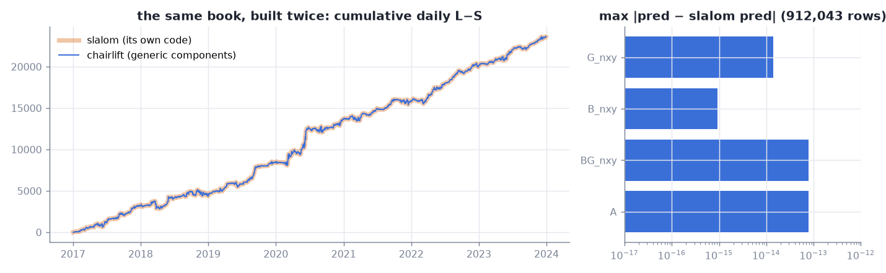

| | chairlift | slalom |
|---|---|---|
| OOS predictions, 912,043 rows: A / B_nxy / G_nxy / BG_nxy | max abs diff 8e-14 / 9e-16 / 1e-15 / 9e-15 | |
| candidate BG_nxy, daily L−S Sharpe [CI99] | **2.160989443263191** [1.4268, 3.0193] | **2.160989443263191** [1.4268, 3.0193] |
| long / short leg daily Sharpe, years positive | 0.5705 / −0.8653, 7/7 | 0.5705 / −0.8653, 7/7 |
| OOS rank IC | 0.106217 | 0.106217 |
| model A on the v1 book, daily L−S Sharpe | 2.40425 | 2.40455 |

The candidate is bit-identical. Model A's book holds the same positions in both builds, but 62 days of 2021 P&L
differ. The cause is a tie in slalom's own option engine, found by this comparison: SWK on 2021-09-08 has two expiries
equally far from the 30-day target, and the engine breaks the tie by row order. slalom's code run three times gives
two answers. The trace is in the slalom client's README.

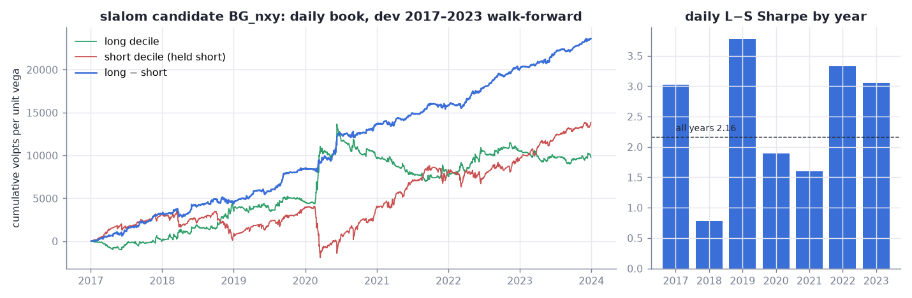

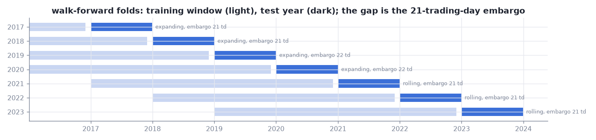

A whole rebuild runs 17 stages in about 15 minutes, two thirds of it LightGBM. The live view, one frame mid-run
([cli/slalom_live.txt](cli/slalom_live.txt)):

```
chairlift slalom  running   411.7s  run 20261001T135504.926066Z-8a425ccf380c
   stage            status   seconds  shape        progress              detail
✓  fit_A            ran      8.21     3680358×5    ━━━━━━━━━━━━━━━━━━━━  7/7 7 folds fitted
✓  fit_B_nxy        ran      91.43    3680358×5    ━━━━━━━━━━━━━━━━━━━━  7/7 7 folds fitted
⠙  fit_G_nxy        running                        ━━━━━━━━━━━           4/7 fold 2021: train 2017-01-01 → exit ≤ 2020-12-02
○  book_A           pending
latest metrics
fit_G_nxy  is_ic     +0.1773    fold=2020
```

Run again, every stage is a hit ([cli/slalom_plan.txt](cli/slalom_plan.txt)).

A second full rebuild refit A and B_nxy to byte-identical outputs, so content addressing made every stage downstream
of them a hit. LightGBM on 16 threads is not bitwise reproducible: 1.2M of 3.7M predictions moved, by at most 1.4e-14.
The book did not move.

## 2. VXX: the modularity test, and a negative result

The instrument is the index VXX tracks, rebuilt from CBOE VX settlements: front and second month, the front weight
rolling to zero over each roll period. The features are 15 VIX-complex states known at the settlement. Closes printed
after 15:00 CT enter lagged a day. The target is the 5-day forward return. The fold is expanding, with a 5-day
embargo, and ridge, LightGBM and their ensemble are fitted. The position is scaled by the training-fold conviction
and pays 5 bp per unit traded.

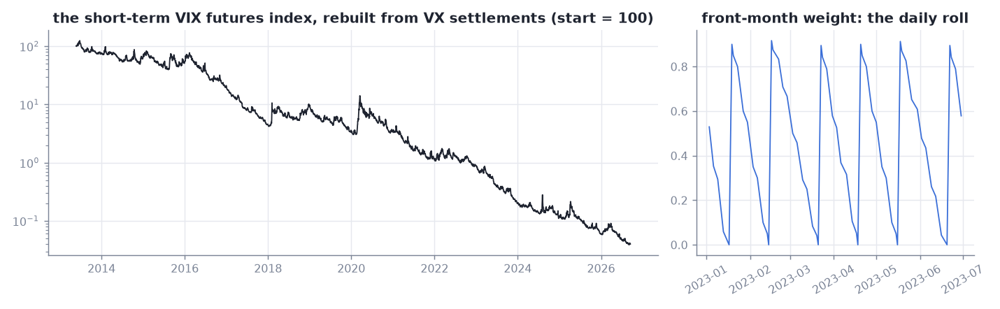

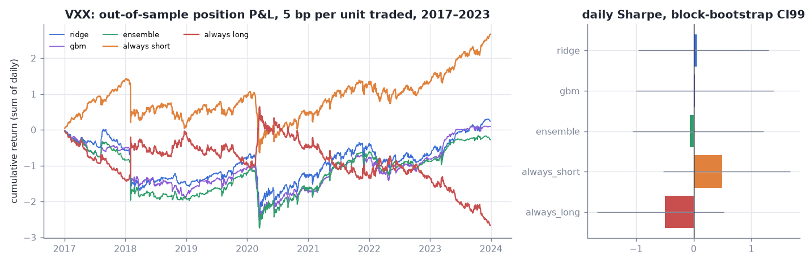

| book, 2017–2023 OOS | daily Sharpe [CI99] | OOS IC | mean abs position |
|---|---|---|---|
| ridge | +0.02 [−0.99, +1.28] | +0.013 | 0.71 |
| LightGBM | +0.02 [−1.00, +1.39] | −0.032 | 0.65 |
| ensemble | −0.06 [−1.06, +1.21] | −0.001 | 0.69 |
| always short | +0.50 [−0.53, +1.68] | | 1.00 |
| always long | −0.50 [−1.68, +0.53] | | 1.00 |

No out-of-sample timing information: the models cut exposure without picking its direction, and standing short (the
volatility risk premium) beats them. In-sample ICs of 0.15–0.69 against roughly zero out of sample are the usual
signature of overfitting, here inflated by overlapping 5-day targets.

What VXX forced chairlift to change: a `cross_section=False` switch on the fit (its checks were within-date), an
ensemble scaled by training-fold moments (within-date z-scores are meaningless with one row; test-period z-scores leak),
and a time-series IC. Folds, models, books and statistics ran unchanged.

### Can regime conditioning beat always short?

Laurent's challenge: surely "short when contango is steep" beats standing short, and if chairlift cannot find that it
needs work. It did need work. Three additions, then the answer:
- a regime-rule learner that searches feature × threshold × side in-fold by the position's own Sharpe
- pre-specified rules on the futures roll yield
- a 1-day target

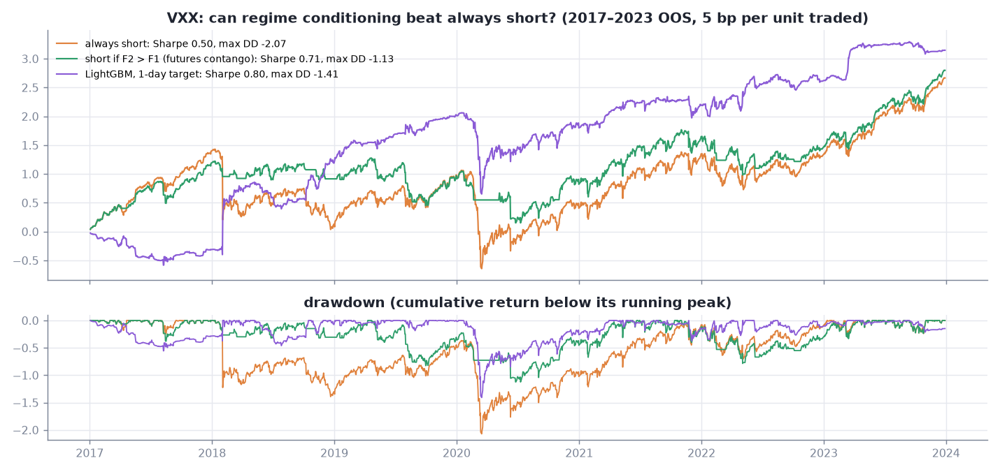

| 2017–2023 OOS, 5 bp | Sharpe [CI99] | max DD | ΔSharpe vs always short [CI99] | Sharpe without its 5 best days |
|---|---|---|---|---|
| always short | 0.50 [−0.53, 1.68] | −2.07 | | 0.34 |
| **short if F2 > F1** (futures contango, pre-specified) | **0.71** [−0.39, 1.79] | **−1.13** | +0.21 [−0.59, 1.08] | **0.57** |
| LightGBM, 1-day target | 0.80 [−0.30, 1.89] | −1.41 | +0.30 [−1.00, 1.50] | 0.50 |
| regime-rule learner, searched in-fold | 0.15 [−0.68, 1.42] | −1.58 | −0.35 [−1.15, 0.73] | |

- **The intuition holds on the point estimates.** The plain futures-contango rule lifts Sharpe and halves the
  drawdown. It keeps its edge when its best days are removed: the edge is losses avoided across many days.
- **The 1-day model is one lucky trade.** It was long into 2018-02-02, and 47% of its P&L is five days.
- **Nothing is established yet.** Every paired difference spans zero. The best of the 27 books examined has a
  deflated Sharpe probability of 0.73 against the expected maximum of 27 null trials (0.56).
- **The in-fold learner found the rule only from 2019**, once its training history contained a spike. Before that
  it had no way to know.
- **What decides it:** the sealed 2024+ holdout, one look, for a registered candidate.

### The one holdout look (2026-10-02)

Candidate A (short in futures contango, volatility-targeted) was registered with three gates
(`vxx_trade/chairlift_client/REGISTRATION.md`), then the 2024+ holdout was opened once through the ledger.

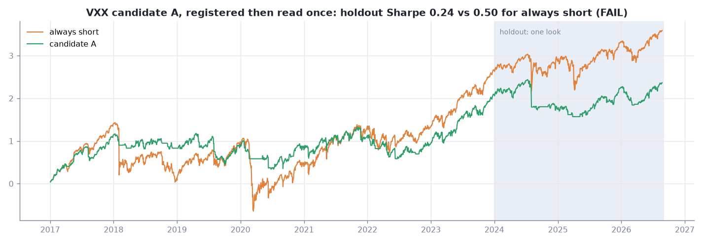

| holdout 2024-01 → 2026-08 | Sharpe [CI99] | max DD |
|---|---|---|
| candidate A | 0.24 [−1.64, 2.14] | −0.867 |
| always short | 0.50 [−0.73, 2.05] | −0.864 |

**FAIL**: G1 passes, G2 fails (Δ −0.26), G3 fails. The contango switch goes flat once the curve inverts. The dev
period's spikes were drawn out, so going flat avoided losses; the holdout's spikes (August 2024, April 2025) were V-shaped,
so it missed the snap-backs. Nothing is refit from the look.

### One command, six experiments

```bash
chairlift sweep chairlift_client/experiments/horizon-sweep.toml
```

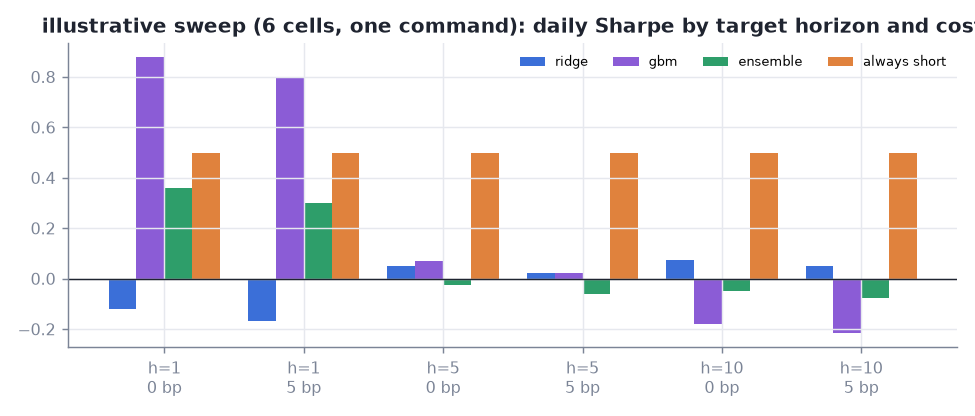

Illustrative only: every cell is a trial and nothing is selected from it. The h=1 LightGBM bar is the kind of number
a sweep produces by chance across six cells. Mechanically, each cell is a run with its own signature. Cells reuse
every stage that an earlier cell, or an earlier run, already built ([cli/vxx_sweep.txt](cli/vxx_sweep.txt)):

```
cell  horizon  cost_bp  signature     ran  reused
0     1        0.0      584e09a9b0b3  6    1
1     1        5.0      70806ecca07d  1    6       ← only the evaluation re-runs when the cost changes
3     5        5.0      3e688a5703ce  0    7       ← same signature as the dev run: nothing to do
```

## 3. Equity long/short on real data: an honest null

S&P 500 members month by month (point-in-time), fundamentals from SEC filings known only once filed, ridge and
LightGBM, a decile book, and the incremental test against four factor books.

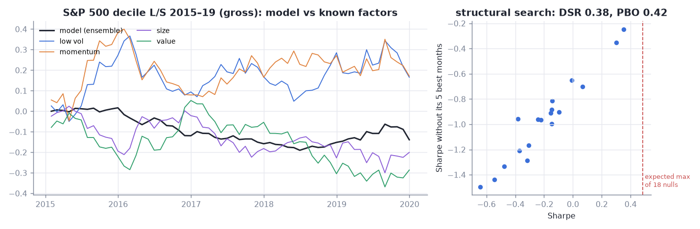

- **Dev 2015–2019:** the ensemble's L/S Sharpe is −0.51 [−1.90, 0.68]. Its alpha after the factors is −3.2%/yr
  (t −1.2).
- **Structural search** (family × model × q, a complexity prior, 18 candidates, `--jobs 6`, 2 min 16 s): the best
  scores 0.35, below the 0.49 expected from 18 nulls. DSR 0.39, PBO 0.42, walk-forward selection 0.04.
- **The release-lag leak test** moves nothing: in this universe, fundamentals carry no one-month IC.

## 4. SPY timing: nothing beats holding

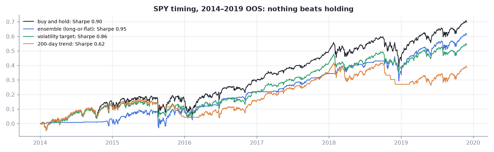

Macro inputs with publication lags (yields, credit spreads, unemployment from the 10th of the next month), VIX and
trend, long-or-flat. On 2014–2019, ridge and the ensemble reach 0.95 against buy-and-hold's 0.90 (Δ +0.05, CI ±0.5).
That is no edge.

## 5. The search judges itself

The same 16-candidate search on the twin with a planted signal and on the null twin:

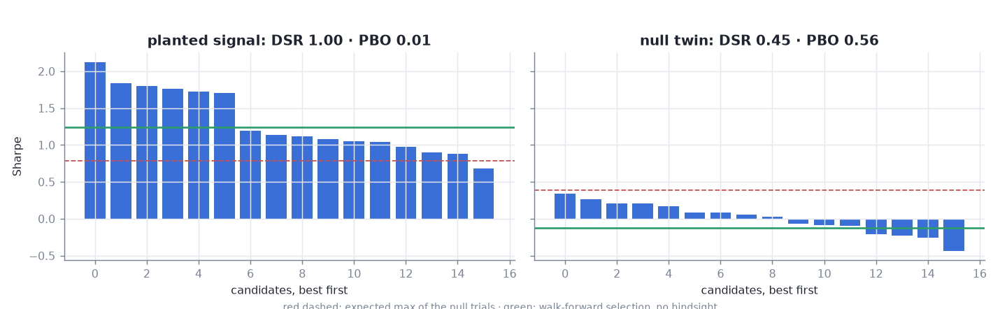

| | best | expected max of 16 nulls | DSR | walk-forward selection | PBO |
|---|---|---|---|---|---|
| planted signal | 2.12 | 0.79 | 1.00 | 1.24 | 0.01 |
| null twin | 0.34 | 0.39 | 0.45 | −0.12 | 0.56 |

## 6. Reproduce and compare

`chairlift rerun RUN` rebuilds a run from its record alone in a fresh directory and byte-compares every output
([cli/vxx_rerun.txt](cli/vxx_rerun.txt)):

```
stage      recorded              reproduced
index      parquet:7748b4c6f187  parquet:7748b4c6f187  identical
...
evaluate   json:1e11b22a0215afb  json:1e11b22a0215afb  identical

20261001T141507.457471Z-3e688a5703ce: reproduced bit for bit
```

`chairlift compare A B` lines up two runs: parameters, spec hashes, data fingerprints, outputs, environment, and the
last value of every metric, including metrics of stages a run reused
([cli/vxx_compare_h1_vs_h5.txt](cli/vxx_compare_h1_vs_h5.txt)).

## Files

| path | what |
|---|---|
| `figures/*.png` | the six figures above |
| `numbers.json` | every number on this page, with the run ids and signatures they come from |
| `cli/*.txt` | terminal transcripts: live view, plan, sweep, rerun, compare, the store's log |
| `build.py` | regenerates figures and numbers from the run records |
